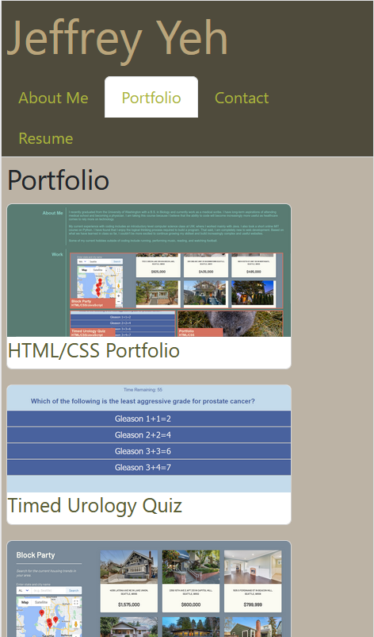

# React Portfolio

Link to deployed application: https://etfruitninja.github.io/my-second-portfolio/

## Description

This application acts as a portfolio website for myself, displaying information about me, my completed coding projects, contact information, resume, and links to my social media accounts.

## Table of Contents
- [Installation](#installation)
- [Usage](#usage)
- [License](#license)
- [Contributing](#contributing)
- [Tests](#tests)
- [Questions](#questions)

## Installation

N/A

## Usage

Use the tabs in the navigation bar to navigate to different pages of the portfolio. Visitors can send email messages using the form in the Contact tab. Visitors can download my resume on the Resume tab. In the footer, visitors can click on the icons to visit my social media pages.

## License

N/A

## Contributing

N/A

## Tests

N/A

## Questions

GitHub Profile: github.com/ETFruitNinja

Email: jeffreyyehuw@gmail.com